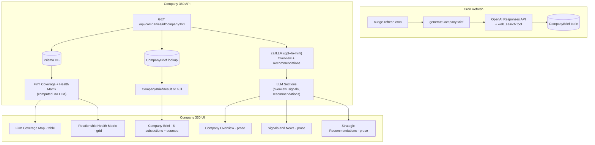

# Enhanced Company 360 with Structured Coverage, Health Matrix, and Company Brief

## Summary

Replace the current Company 360's prose-only sections with a three-tier intelligence view:
- **Structured CRM data** for Firm Coverage Map (table) and Relationship Health Matrix (grid)
- **Existing LLM synthesis** for Company Overview, Signals/News, and Strategic Recommendations
- **New web-researched Company Brief** using OpenAI Responses API with `web_search` tool for deep financial/operational synthesis with cross-referenced sources

## Architecture



## Key Files to Modify

- [`src/lib/services/llm-company360.ts`](src/lib/services/llm-company360.ts) — Update types, remove `coverage` and `health` from LLM sections, add `CompanyBriefResult` types
- [`src/lib/services/llm-core.ts`](src/lib/services/llm-core.ts) — Add `callLLMWithWebSearch` using OpenAI Responses API
- [`src/app/api/companies/[id]/company360/route.ts`](src/app/api/companies/[id]/company360/route.ts) — Return structured coverage/health data + cached CompanyBrief alongside LLM sections
- [`src/app/companies/[id]/page.tsx`](src/app/companies/[id]/page.tsx) — Replace prose sections with structured UI components
- [`prisma/schema.prisma`](prisma/schema.prisma) — Add `CompanyBrief` model
- [`src/app/api/cron/nudge-refresh/route.ts`](src/app/api/cron/nudge-refresh/route.ts) — Add Company Brief generation to cron pipeline

## New Files

- `src/lib/services/llm-company-brief.ts` — `generateCompanyBrief()` function using Responses API with web_search
- `src/app/api/companies/[id]/company-brief/refresh/route.ts` — On-demand refresh endpoint for the Company Brief

---

## Section 1: Prisma Schema — CompanyBrief Model

Add to [`prisma/schema.prisma`](prisma/schema.prisma):

```prisma
model CompanyBrief {
  id          String   @id @default(cuid())
  companyId   String
  company     Company  @relation(fields: [companyId], references: [id])
  content     String   // JSON: { subsections: BriefSubsection[], sources: BriefSource[] }
  model       String   // "gpt-4o-mini" or "gpt-4o"
  generatedAt DateTime @default(now())
  expiresAt   DateTime
  @@index([companyId, generatedAt])
}
```

Add `briefs CompanyBrief[]` relation to `Company` model.

## Section 2: OpenAI Responses API — `callLLMWithWebSearch`

New function in [`src/lib/services/llm-core.ts`](src/lib/services/llm-core.ts):

```typescript
export async function callLLMWithWebSearch(
  systemPrompt: string,
  userPrompt: string,
  options?: { model?: string; maxOutputTokens?: number }
): Promise<{ text: string; citations: WebSearchCitation[] } | null>
```

- Uses `openai.responses.create()` (Responses API, not Chat Completions)
- Model: configurable via `COMPANY_BRIEF_MODEL` env var, defaults to `gpt-4o-mini`
- Tools: `[{ type: "web_search_preview" }]`
- Returns the response text plus extracted citation URLs from the `web_search_call` output
- Graceful fallback: if Responses API fails, returns null (template fallback in caller)

## Section 3: Company Brief Generation Service

New file `src/lib/services/llm-company-brief.ts`:

**Types:**

```typescript
interface CompanyBriefSubsection {
  id: string;  // "financial", "strategic", "mna", "leadership", "market", "sentiment"
  title: string;
  content: string;  // Markdown with inline [sN] citations
}

interface CompanyBriefSource {
  id: string;         // "s1", "s2", etc.
  title: string;
  type: "filing" | "transcript" | "news" | "analyst" | "other";
  url: string;
  date: string;
  publisher?: string;
}

interface CompanyBriefResult {
  subsections: CompanyBriefSubsection[];
  sources: CompanyBriefSource[];
  generatedAt: string;
  model: string;
}
```

**System prompt** instructs the model to:

1. Research the company across 6 dimensions:
   - Operational and Financial Performance
   - Strategic Initiatives
   - M&A and Transactions
   - Leadership and Governance
   - Market and Regulatory Developments
   - Analyst and Market Sentiment (including current stock price, YTD trend, market cap, consensus ratings, price targets)
2. Cross-reference claims across at least 2 source types (filings vs. transcripts vs. news) where possible
3. Include select direct excerpts (e.g., CEO quotes from earnings calls) where they add insight
4. Flag any conflicting information between sources
5. Return structured JSON with 6 subsections and a sources array
6. Use bracketed `[s1]` style inline citations in the prose

**Template fallback**: If the API call fails, return a minimal brief with "Company Brief unavailable — click Refresh to try again" message.

## Section 4: Enhanced Company 360 API Response

Update [`src/app/api/companies/[id]/company360/route.ts`](src/app/api/companies/[id]/company360/route.ts):

**New response shape:**

```typescript
{
  company: { id, name, industry },
  result: {
    summary: string,
    sections: Company360Section[],  // now only: overview, signals, recommendations (3 not 5)
    firmCoverage: {
      totalPartners: number,
      totalContacts: number,
      partners: {
        name: string,
        isCurrentUser: boolean,
        contactCount: number,
        totalInteractions: number,
        lastInteractionDate: string | null,
      }[],
    },
    healthMatrix: {
      name: string,
      title: string,
      importance: string,
      interactionCount: number,
      lastInteractionDate: string | null,
      daysSinceLastInteraction: number | null,
      intensity: string,      // "Very High" | "High" | "Medium" | "Light" | "Cold"
      intensityScore: number,
      sentiment: string | null,
      openNudges: number,
      contactId: string,      // for navigation links
    }[],
    companyBrief: CompanyBriefResult | null,  // from cached CompanyBrief table
  },
}
```

- `firmCoverage` is computed from the existing `partnerMap` logic (already in the route)
- `healthMatrix` is computed from contacts + existing `computeIntensity` logic (from the company detail API — extract and reuse)
- `companyBrief` is loaded from the `CompanyBrief` table (most recent non-expired entry for this company)
- LLM prompt updated to only generate `overview`, `signals`, `recommendations` (remove `coverage` and `health` section IDs)

## Section 5: On-Demand Company Brief Refresh

New endpoint: `POST /api/companies/[id]/company-brief/refresh`

- Auth: `requirePartnerId()`, verify company access
- Calls `generateCompanyBrief(companyName, companyIndustry)`
- Stores result in `CompanyBrief` table with 24h expiry
- Returns the fresh `CompanyBriefResult`
- UI calls this when user clicks the "Refresh" button on the Company Brief section

## Section 6: Cron Integration

In [`src/app/api/cron/nudge-refresh/route.ts`](src/app/api/cron/nudge-refresh/route.ts):

- After the existing nudge refresh + news ingestion, add a Company Brief refresh step
- Query companies with recent activity (interactions or signals in the last 7 days) whose latest `CompanyBrief.generatedAt` is older than 24 hours
- Generate briefs in batches of 3 (to respect rate limits)
- Log success/failure per company
- This is non-blocking: if brief generation fails, it doesn't affect nudge refresh

## Section 7: UI Components

In [`src/app/companies/[id]/page.tsx`](src/app/companies/[id]/page.tsx):

### Firm Coverage Map Table
- Replaces the `coverage` prose section
- Compact table: Partner | Contacts | Interactions | Last Active
- Current user row gets subtle blue background highlight
- "Last Active" date turns amber if >30 days, red if >60 days
- Empty state: "No partner coverage data available"

### Relationship Health Matrix Grid
- Replaces the `health` prose section
- Each contact rendered as a compact row: Name (linked) + Title, Importance badge (color-coded), Interaction count, Last contact date with staleness color, Intensity pill
- Sorted: CRITICAL first, then by staleness (most stale contacts bubble up)
- Cold/stale contacts get a subtle red-left-border accent
- Empty state: "No contacts tracked at this company"

### Company Brief Card
- New section between Health Matrix and Signals
- Header: "Company Brief" title + "Generated 3 hours ago" timestamp + Refresh button (circular arrow icon)
- 6 collapsible subsections using existing expand/collapse pattern
- Inline `[s1]` citations in markdown rendered as superscript clickable links scrolling to Sources
- Sources footer (always visible when Brief section is expanded):
  - Grouped by type with icons: filing, transcript, news, analyst
  - Each source: title (linked to URL), publisher, date
- Loading state: Skeleton + "Generating Company Brief..." when refreshing
- Null state (no cached brief): "Company Brief not yet available. Click Refresh to generate." with prominent Refresh button

### Section Ordering in UI
1. Company Overview (LLM prose)
2. Firm Coverage Map (structured table)
3. Relationship Health Matrix (structured grid)
4. Company Brief (web-researched, 6 subsections + sources)
5. Signals and News (LLM prose)
6. Strategic Recommendations (LLM prose)

## Section 8: Environment Configuration

Add to [`.env.example`](.env.example):

```
# Company Brief (OpenAI web search)
COMPANY_BRIEF_MODEL=gpt-4o-mini   # or gpt-4o for higher quality
COMPANY_BRIEF_EXPIRY_HOURS=24
```

## Section 9: Template Fallback Behavior

The existing template fallback system is preserved:
- If OpenAI API key is missing: all LLM sections use template fallback, Company Brief shows "not available"
- If Responses API call fails: Company Brief shows "not available" with Refresh button
- If callLLM fails for overview/signals/recommendations: existing template fallback generates those sections
- Firm Coverage and Health Matrix never need LLM — they always render from CRM data

## Migration Notes

- Prisma migration required for `CompanyBrief` model
- No breaking changes to existing Company 360 API consumers (new fields are additive)
- Chat intent (`company_360`) in `chat/route.ts` can continue using the existing context assembly; Company Brief is page-only for now
