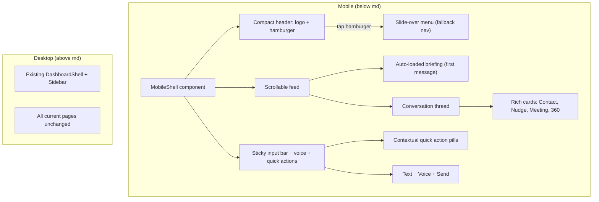

# Mobile Conversational Interface for Activate

## The Bet

Mobile Activate is a single conversational surface. No tabs, no navigation hierarchy. The briefing is the first message, the LLM is the navigation. Partners check their phone before a meeting, read the briefing, tap a quick action or ask a question, and pocket it. 60 seconds.

Desktop (above `md` / 768px) stays exactly as it is today. Every change is additive, scoped to the `md:` breakpoint.

## Architecture



## Competitive Context

- **Salesforce Spring 2026**: AI-powered "Sales Workspace" hub with personalized recommendations. Still tab-based navigation.
- **Affinity Q2 2025**: Relationship status badges, deep linking, enhanced search. Traditional list/detail nav.
- **HubSpot Breeze**: Dedicated AI assistant mobile app with voice input, meeting prep, artifact review. Closest to our approach but as a separate app, not the primary interface.

**What makes Activate different:** No CRM puts the AI briefing as the literal home screen with conversation as the only navigation. This is a bet that the LLM quality is high enough to replace traditional nav for the mobile use case.

## Files to Create

### 1. `src/components/layout/mobile-shell.tsx` (NEW)

The mobile-only app chrome. Replaces `DashboardShell` below `md`.

- Full viewport height (`h-[100dvh]`)
- **Header**: Activate logo (left) + avatar/hamburger (right)
- **Slide-over menu** (triggered by hamburger): all 8 nav items from current sidebar + Sign out. Uses a `<dialog>` or fixed overlay with backdrop blur. Links to existing pages (which will also use `MobileShell` on mobile).
- **Children slot** for page content
- Safe area insets for notched phones: `env(safe-area-inset-top)`, `env(safe-area-inset-bottom)`

### 2. `src/app/mobile/page.tsx` (NEW)

The unified mobile home. Combines briefing + chat in one feed.

- On mount: fetch briefing from `/api/briefing/today` (same endpoint dashboard uses)
- Render briefing as the first "assistant" message with Activate avatar
- Below briefing: contextual quick action pills (time-aware, briefing-aware)
- Chat input bar pinned to bottom (above safe area)
- After user sends a message or taps a quick action, the conversation continues using the existing `/api/chat` endpoint
- Reuses all existing chat logic from `src/app/chat/page.tsx`: `handleSend`, `buildHistory`, `AssistantReply` component, voice recognition

**Quick action pill logic** (above the input bar):

- Time-based: "Show my meetings today" (morning), "Prep for [next meeting]" (if meeting within 2h)
- Briefing-based: parse briefing for contact names, offer "Quick 360 on [top contact]"
- Post-response: reuses existing `getUsedActions()` from chat route to avoid duplicates
- Always available: "What should I do today?", "Who needs attention?"

### 3. `src/app/layout.tsx` (MODIFY)

Add viewport meta for mobile:

```tsx
export const viewport: Viewport = {
  width: "device-width",
  initialScale: 1,
  viewportFit: "cover",
};
```

This enables `env(safe-area-inset-*)` for notched devices.

## Files to Modify

### 4. `src/components/layout/dashboard-shell.tsx`

Add responsive shell switching. Below `md`, render `MobileShell` instead of the sidebar layout.

Current code wraps everything in `flex h-screen` with `Sidebar`. The change:

- Import `MobileShell`
- Use a `useMediaQuery` hook (or Tailwind's `md:` classes) to conditionally render:
  - Below `md`: `<MobileShell>{children}</MobileShell>`
  - Above `md`: current sidebar layout (unchanged)

Alternatively, use pure CSS: render both shells, hide one with `hidden md:flex` / `md:hidden`. The CSS approach is simpler and avoids hydration mismatches.

### 5. `src/app/globals.css`

Add safe-area padding utility and mobile-specific tokens:

```css
@supports (padding: env(safe-area-inset-bottom)) {
  :root {
    --safe-area-bottom: env(safe-area-inset-bottom);
    --safe-area-top: env(safe-area-inset-top);
  }
}
```

### 6. `src/app/chat/page.tsx`

On mobile, the chat page should use the same conversational layout (no "Ask Anything" header, no card wrapper). The `ChatPageContent` component should detect mobile and render a slimmer version, or the mobile route handles chat directly.

Two approaches:

- **Option A (recommended):** Extract the chat logic (state, handlers, message rendering) into a shared hook `useChatSession()` or a headless component. Both `src/app/chat/page.tsx` and `src/app/mobile/page.tsx` consume it.
- **Option B:** On mobile, `/chat` redirects to `/mobile` with the same `?q=` parameter.

Option A is cleaner. The extracted hook would contain: `messages`, `input`, `loading`, `handleSend`, `handleClearChat`, `handleKeyDown`, voice recognition state.

### 7. `src/app/dashboard/page.tsx`

On mobile, the dashboard can either:

- Redirect to `/mobile` (simplest)
- Or render the same `MobileShell` with briefing + chat

Redirect is cleaner. Add at the top of the component:

```tsx
const isMobile = useMediaQuery("(max-width: 767px)");
if (isMobile) redirect("/mobile");
```

Or handle via middleware for SSR.

### 8. Other pages (nudges, contacts, companies, meetings)

These pages continue to work on mobile via `MobileShell` (which gives them the compact header + hamburger instead of sidebar). No layout changes needed in Phase 1. Content already uses responsive Tailwind classes (`sm:flex-row`, `hidden md:block`, etc.).

Future phases can add:

- Filter bottom sheets for nudges/meetings
- Card layouts for contact/company lists
- Swipe actions on nudge cards

## Key Design Decisions

- **`100dvh` not `100vh`**: Use dynamic viewport height to handle mobile browser chrome (Safari address bar)
- **No hydration mismatch**: Use CSS `hidden md:flex` / `md:hidden` rather than JS-based media queries for the shell switch. Both shells render in HTML, CSS hides the wrong one.
- **Briefing as first message**: The briefing content is already fetched as markdown. Rendering it through `AssistantReply` + `MarkdownContent` means all the same styling, quick actions, and rich formatting works immediately.
- **Shared chat logic**: Extract into `src/hooks/use-chat-session.ts` so both desktop chat page and mobile home reuse the same state management, API calls, and voice recognition.
- **Progressive enhancement**: If briefing fetch fails, show the suggested questions (same as current empty chat state). The mobile experience degrades gracefully to a chat interface.
- **Slide-over menu**: This is the escape hatch. If the LLM can't surface what the user needs, they tap the hamburger and get direct links to every section. The menu is the same 8 items as the current sidebar.

## Visual Spec (Mobile)

```
+----------------------------------+
| [Logo]  Activate    [Avatar/Menu]|  <- 48px header, safe-area-top padding
+----------------------------------+
|                                  |
| [Activate avatar]                |
| Good Morning, Morgan             |
|                                  |
| Your most important move today   |
| is reaching out to **Anat        |
| Ashkenazi** at **Google**...     |
|                                  |
| [Quick 360: Anat] [Prep QBR]    |  <- inline quick actions from briefing
|                                  |
| Today's meetings:                |
| - QBR with Microsoft, 3:30 PM   |
|                                  |
| ---                              |
|                                  |
| [user] Show me the full 360     |
|        on Anat Ashkenazi         |
|                                  |
| [Activate avatar]                |
| ## Insight Summary               |
| Anat is Google's CFO...          |
| ## Talking Points                |
| 1. Congratulate on Q4 results   |
| [Company 360] [Draft Email]     |
|                                  |
+----------------------------------+
| [Quick 360: Andy] [My meetings] |  <- contextual pills
| [What should I do today?]        |
+----------------------------------+
| [Ask about your clients...] [mic]|  <- input bar, safe-area-bottom
+----------------------------------+
```

## Not In Scope (Phase 1)

- Dark mode
- PWA / service worker / offline
- Push notifications
- Filter bottom sheets for nudge/meeting pages
- Card layout refactor for contact/company list pages
- Swipe gestures on cards
- Biometric auth (Face ID)

These are all strong Phase 2 candidates once the core conversational mobile experience ships and gets user feedback.
