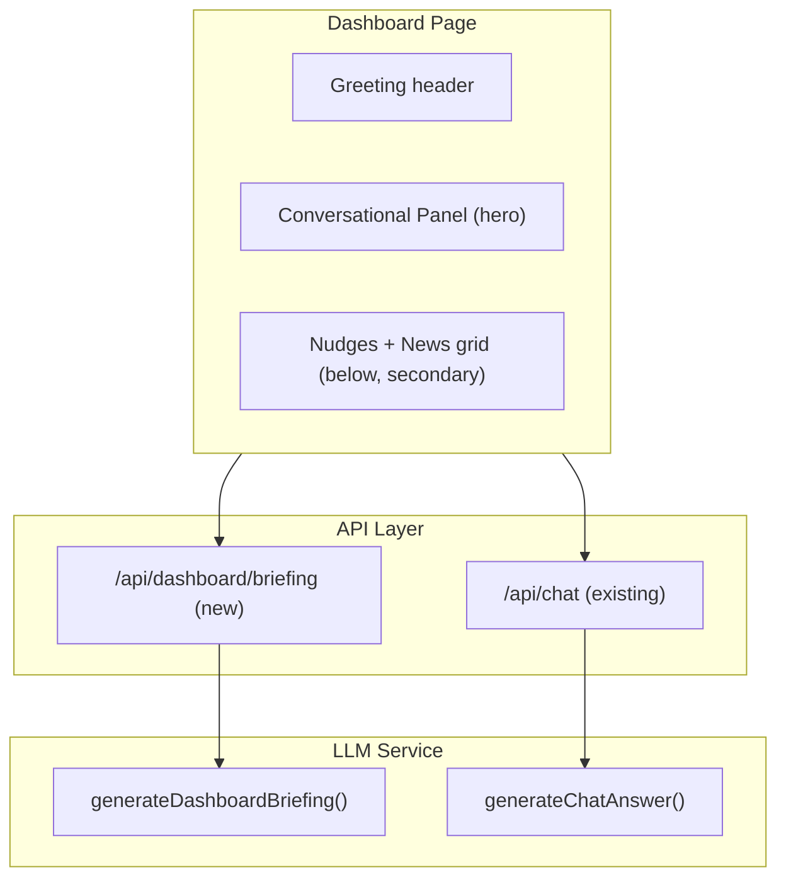

# Dashboard Conversational UI Upgrade

## Current State

The dashboard (`[src/app/dashboard/page.tsx](src/app/dashboard/page.tsx)`) has three vertical sections stacked with `space-y-8`:

1. **Greeting** — "Good Morning, {name} / What's on your mind?" (text only)
2. **Chat bar** — a single-line `<input>` inside a `Card` with suggested-question chips; on submit it navigates to `/chat?q=...`
3. **Two-column grid** — 60/40 split with "Today's Top Nudges" (left) and "Client News" (right)

The chat bar is essentially a search launcher — it does not display any AI response on the dashboard itself. There is no auto-generated summary.

## Goal

1. **Make conversational AI front-and-center** — elevate the chat from a thin search bar to an inline conversational panel that shows messages directly on the dashboard.
2. **Auto-generate a morning briefing** — when the user lands on the dashboard, immediately fire a request to produce a short AI summary of today's nudges, upcoming meetings, and fresh client news, displayed as the first assistant message.

## Architecture




## Detailed Changes

### 1. New API endpoint: `/api/dashboard/briefing`

**File:** `src/app/api/dashboard/briefing/route.ts` (new)

- Authenticated `GET` endpoint
- Gathers the same data the dashboard already fetches (top 5 open nudges, today/tomorrow meetings with briefs, recent client news) using existing repositories
- Calls a new `generateDashboardBriefing()` function in `llm-service.ts`
- Returns `{ briefing: string }` — a 3-5 sentence natural-language summary
- Includes a deterministic template fallback when `OPENAI_API_KEY` is not set (same pattern as existing LLM functions)

### 2. New LLM function: `generateDashboardBriefing()`

**File:** `[src/lib/services/llm-service.ts](src/lib/services/llm-service.ts)` (add to existing)

- Accepts `{ partnerName, nudges, meetings, clientNews }` context
- System prompt: "You are Activate. Generate a concise, warm morning briefing (3-5 sentences) for a Partner. Highlight the most important nudges, upcoming meetings, and notable client news. Be conversational and actionable."
- Template fallback: deterministic summary built from the same data (e.g. "You have 3 open nudges today — the highest priority is reconnecting with Jane Doe at Acme Corp. You also have a meeting with...")

### 3. Restructure dashboard layout — conversational panel as hero

**File:** `[src/app/dashboard/page.tsx](src/app/dashboard/page.tsx)`

**New layout (top to bottom):**

- **Greeting** — keep as-is (time-based greeting + "What's on your mind?")
- **Conversational panel (hero)** — a full-width `Card` with:
  - A scrollable message area (like `/chat` but inline) showing assistant/user messages
  - The auto-generated briefing appears as the first assistant message (with a typing/loading indicator while it loads)
  - The input bar at the bottom of this card (text input + voice + send button + suggested chips)
  - On submit, messages are handled **inline** via `POST /api/chat` — no more navigating away to `/chat`
  - Minimum height ~300px, max height ~50vh so it dominates the viewport but the data grid is still visible below
- **Data grid** — the existing two-column "Today's Top Nudges" + "Client News" grid stays below, but is now secondary context

**Key state changes to the dashboard component:**

- Add `messages: Message[]` state (same type as `/chat`)
- Add `briefingLoading: boolean` state
- On mount: fetch dashboard data AND fetch `/api/dashboard/briefing` in parallel
- When briefing arrives, push it as the first assistant message
- `handleChatSubmit` now calls `/api/chat` inline and appends to `messages[]` instead of `router.push()`
- Reuse `AssistantReply` component from `[src/components/chat/assistant-reply.tsx](src/components/chat/assistant-reply.tsx)` for rendering assistant messages

### 4. Keep `/chat` page as-is

The full `/chat` page continues to work as a standalone deep-dive conversation tool. The dashboard conversation is a lightweight "start here" experience; users can still navigate to `/chat` for extended sessions. The sidebar "Ask Anything" link remains.

## Visual Layout Before vs After

```
BEFORE:                          AFTER:
+---------------------------+    +---------------------------+
| Good Morning, Alex        |    | Good Morning, Alex        |
| What's on your mind?      |    | What's on your mind?      |
+---------------------------+    +---------------------------+
| [____search bar____] Ask  |    | Conversational Panel      |
| [chip] [chip] [chip]      |    | +- - - - - - - - - - - -+|
+---------------------------+    | | AI: Here's your morning ||
| Nudges (60%) | News (40%) |    | | briefing. You have 3   ||
|              |             |    | | high-priority nudges..  ||
|              |             |    | +- - - - - - - - - - - -+|
|              |             |    | [____input_____] Mic Ask  |
+---------------------------+    | [chip] [chip] [chip]      |
                                 +---------------------------+
                                 | Nudges (60%) | News (40%) |
                                 |              |             |
                                 +---------------------------+
```

## Edge Cases

- **No nudges / no meetings / no news:** The briefing gracefully handles empty data ("Looks like a quiet day — no urgent nudges or meetings on your calendar.")
- **LLM unavailable:** Falls back to deterministic template, never shows an error
- **Briefing still loading:** Show a shimmer/typing animation as the first message bubble
- **User types before briefing loads:** Allow it; briefing message stays at position 0, user messages append below

## Files Changed


| File                                      | Change                                                                       |
| ----------------------------------------- | ---------------------------------------------------------------------------- |
| `src/app/api/dashboard/briefing/route.ts` | New — briefing API endpoint                                                  |
| `src/lib/services/llm-service.ts`         | Add `generateDashboardBriefing()` + template fallback                        |
| `src/app/dashboard/page.tsx`              | Major — inline conversation panel, auto-briefing on load, layout restructure |


