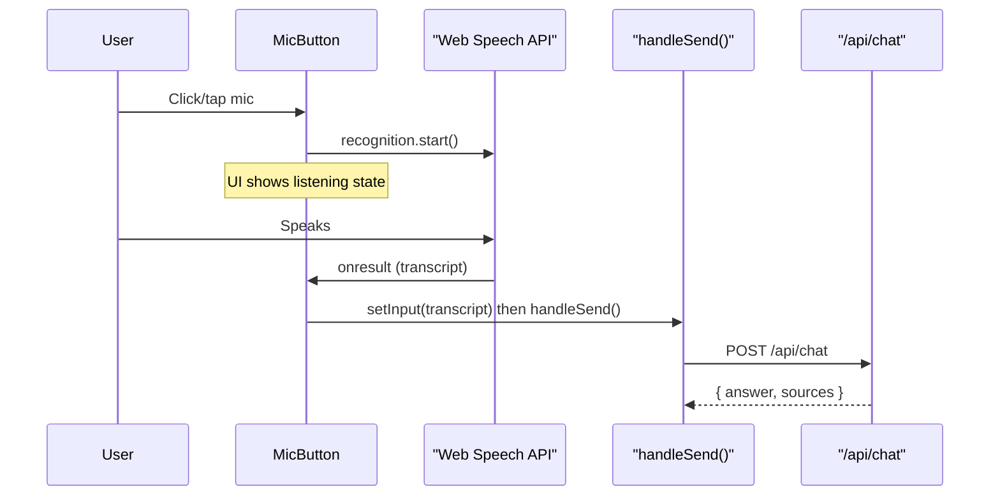

# Voice Entry for Chat Window

**Status:** Completed  
**Last updated:** 2026-03-25

## Overview

Add a microphone button to the chat input bar that uses the browser Web Speech API to capture voice, transcribe it to text, and automatically send the message. Applied to both the Chat page (`/chat`) and the Dashboard conversation bar.

## Architecture

Use the **Web Speech API** (`webkitSpeechRecognition` / `SpeechRecognition`) — zero dependencies, no server cost. After transcription completes, the message is **auto-sent** via the existing `handleSend()` flow.

## Implementation

### 1. Reusable hook: `src/hooks/use-speech-recognition.ts`

Encapsulates all Web Speech API logic:

- **State**: `isListening`, `transcript`, `isSupported`, `error`
- **Methods**: `startListening()`, `stopListening()`
- **Config**: `lang` (default `"en-US"`), `onResult` callback (fires with final transcript)
- Handles browser prefixes (`webkitSpeechRecognition` vs `SpeechRecognition`)
- `continuous: true` — stays listening until user stops or speaks
- Auto-restarts on unexpected `onend` (e.g. no-speech timeout) unless user explicitly stopped
- `interimResults = true` for real-time transcript preview in the input field
- Fires `onResult` only on `isFinal` transcript
- Handles `not-allowed` / `service-not-allowed` with clear error message
- Cleans up on unmount

### 2. Chat page: `src/app/chat/page.tsx`

Input bar layout: `[textarea] [mic button] [send button]`

- `useSpeechRecognition` with `onResult` callback → `setInput(transcript)` + `handleSend(transcript)`
- `pendingVoiceRef` pattern ensures auto-send fires after `isListening` flips to false
- Live interim transcript fills the textarea as user speaks

### 3. Dashboard page: `src/app/dashboard/page.tsx`

Chat bar layout: `[sparkles-input] [mic button] [ask button]`

- Same `useSpeechRecognition` hook
- On final transcript → `router.push(/chat?q=...)` (same as typing + clicking Ask)
- "Ask" button text changes to "Listening…" while active

### 4. Visual states

| State                     | Icon     | Style                                           |
| ------------------------- | -------- | ----------------------------------------------- |
| Idle                      | `Mic`    | `variant="ghost"`, muted foreground             |
| Listening                 | `Mic`    | Red destructive with pulse + ping ring animation |
| Unsupported browser       | Hidden   | Button not rendered                             |
| Loading (chat processing) | `MicOff` | Disabled, reduced opacity                       |

"Listening..." indicator with pulsing red dot appears below the input on the Chat page.

## Files

| File | Change |
|------|--------|
| `src/hooks/use-speech-recognition.ts` | New — reusable Web Speech API hook |
| `src/app/chat/page.tsx` | Added mic button, voice hook, auto-send wiring |
| `src/app/dashboard/page.tsx` | Added mic button, voice hook, auto-navigate wiring |

## Browser Support

- **Full support**: Chrome, Edge, Safari, Chromium-based browsers
- **Partial**: Firefox (limited Web Speech API support)
- **Graceful degradation**: `isSupported` flag hides the mic button on unsupported browsers

## Requirements

- Microphone permission must be granted by the user
- Must be accessed via secure context (`localhost` or HTTPS)
