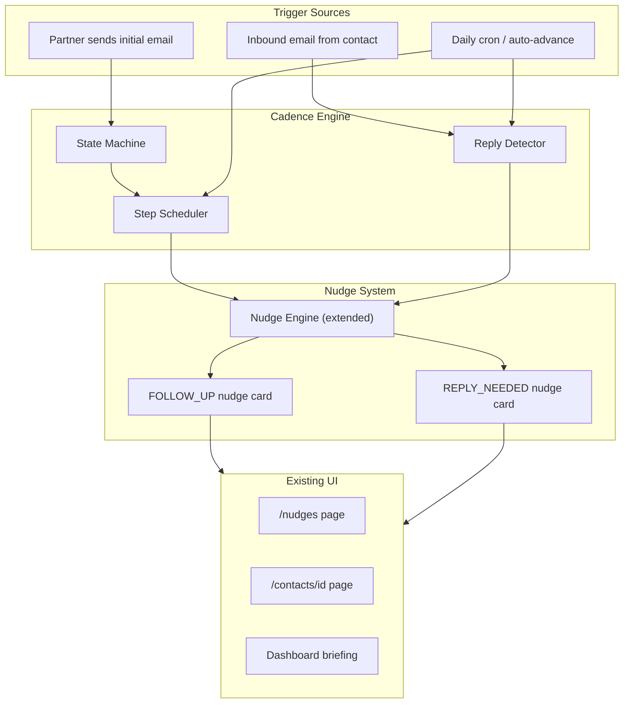

# Smart Nudge Sequencing (Cadence Engine)

**Status:** PLAN  
**Date:** 2026-03-27  
**Branch:** feat/nudge-improvements

## Overview

Build a cadence engine that manages multi-step outreach as an extension of the existing nudge model -- no new pages, no new UX concepts. Follow-up steps surface as natural nudge cards ("Follow up with Alex -- no response in 3 days"), drafts adjust per step, and inbound emails from priority contacts trigger "reply needed" nudges.

## Key Design Decisions

**1. Sequences live inside nudges, not alongside them.** There is no `/sequences` page. The cadence engine runs behind the scenes and surfaces each follow-up step as a nudge card with natural language: "Follow up with Alex Thompson -- no response in 3 days." The draft email automatically adjusts based on which step the partner is on. To the user, it just looks like the system is intelligently reminding them.

**2. Inbound emails create "reply needed" nudges.** When a priority contact emails the partner and the partner hasn't responded within a configurable window, a new nudge type (`REPLY_NEEDED`) appears: "Sarah Chen emailed you 2 days ago -- draft a reply?" This uses the existing Interaction model (inbound emails are type `EMAIL` with sentiment or direction metadata).

**3. A "Follow-ups" filter on the existing /nudges page** gives partners a focused view of all sequence-driven and reply-needed nudges without introducing a new concept.

**4. No step numbers in the UI.** Step numbers are internal to the engine and LLM only. The user sees "No response in 3 days" and "Active outreach -- waiting for response (3 days)", never "Step 2 of 4". The system feels like intelligent reminders, not a sales pipeline.

## Architecture

## Data Model

Two new models added to `prisma/schema.prisma`. The existing `Nudge` and `Interaction` models get small additions.

### New: OutreachSequence

One per contact per active outreach campaign. Linked back to the origin nudge.

- `id`, `contactId`, `nudgeId` (origin nudge that spawned this), `partnerId`
- `status`: `ACTIVE | PAUSED | COMPLETED | ARCHIVED`
- `currentStep`: Int (0-based)
- `totalSteps`: Int (default 4)
- `angleStrategy`: String (AI-chosen angle: "check-in", "congratulations", "news-based")
- `nextStepAt`: DateTime (when the next follow-up should fire)
- `completedAt`: DateTime?
- `createdAt`, `updatedAt`

### New: CadenceStep

Each step in a sequence, including the initial outreach.

- `id`, `sequenceId` (FK)
- `stepNumber`: Int (0 = initial, 1 = first follow-up...)
- `type`: `INITIAL | FOLLOW_UP | ESCALATION | FINAL`
- `status`: `PENDING | DRAFTED | SENT | RESPONDED | SKIPPED`
- `scheduledAt`: DateTime
- `executedAt`: DateTime?
- `emailSubject`, `emailBody`: String? (generated draft)
- `nudgeId`: String? (FK to the nudge card that surfaces this step)
- `responseDetectedAt`: DateTime?
- `interactionId`: String? (FK to Interaction when response is recorded)
- `createdAt`

### Extended: Nudge model

- `sequenceId`: String? (FK to OutreachSequence -- links follow-up nudges to their sequence)
- `cadenceStepId`: String? (FK to CadenceStep -- which step this nudge represents)

This lets the nudge card know it's part of a sequence and render accordingly (days since last attempt, sequence status, etc.). Step numbers are internal only -- never shown to the user.

### Extended: Interaction model

- `direction`: String? (`INBOUND | OUTBOUND`) -- needed to distinguish contact-initiated emails from partner-sent
- `cadenceStepId`: String? (FK to CadenceStep -- attributes interactions to sequence steps)
- `repliedAt`: DateTime? -- tracks when the partner responded to an inbound interaction

### New nudge types

Two new `ruleType` values in the nudge engine:

- **`FOLLOW_UP`** -- "Follow up with Alex Thompson at Google. No response in 3 days." Generated by the cadence engine when a step is due.
- **`REPLY_NEEDED`** -- "Sarah Chen emailed you 2 days ago. Draft a reply?" Generated by the reply detector when an inbound email from a priority contact has no partner response.

Both integrate into the existing consolidated nudge card model. They get their own icon, color, and CTA label in `NUDGE_TYPE_CONFIG`.

## State Machine Logic

New service: `src/lib/services/cadence-engine.ts`

### Sequence lifecycle

**kickoff(nudgeId, partnerId):**

1. Create `OutreachSequence` linked to the nudge
2. Create step 0 (INITIAL) with draft from the existing `generateEmail`
3. Set sequence status to ACTIVE
4. The existing nudge card's "Draft Email" CTA now shows the sequence-aware draft

**markSent(sequenceId, stepNumber):**

1. Update step status to SENT, set `executedAt`
2. Log an Interaction (type: EMAIL, direction: OUTBOUND, cadenceStepId)
3. Update `contact.lastContacted`
4. Schedule next step: set `nextStepAt` on the sequence
5. Mark the origin nudge as DONE

**advanceStep(sequenceId):** (called by cron when `nextStepAt` passes)

1. Check if current step got a response -- if yes, complete sequence
2. If no response, create next CadenceStep with adjusted angle
3. Generate follow-up draft via `generateFollowUpEmail` (step-aware)
4. Create a new `FOLLOW_UP` nudge card: "Follow up with {name}. No response in {N} days."
5. The nudge card's draft panel shows the step-aware email

**recordResponse(contactId):** (called when inbound interaction detected)

1. Find active sequence for this contact
2. Mark current step as RESPONDED
3. Set sequence status to COMPLETED
4. Auto-dismiss any pending FOLLOW_UP nudges for this contact

### Reply detection (new)

**detectUnrepliedInbound(partnerId):** (called by cron)

1. Query recent Interactions where `direction = INBOUND` and `repliedAt IS NULL`
2. Filter to contacts with importance >= MEDIUM (configurable)
3. For each unreplied inbound older than the threshold (default 24h for CRITICAL, 48h for HIGH, 72h for MEDIUM):
   - Check if a REPLY_NEEDED nudge already exists for this contact
   - If not, create one: "Sarah Chen emailed you 2 days ago. Draft a reply?"
4. When partner responds (new OUTBOUND interaction), set `repliedAt` on the inbound and dismiss the REPLY_NEEDED nudge

### Default step schedule

| Step | Type | Delay | Draft angle |
|------|------|-------|-------------|
| 0 | INITIAL | Immediate | Original nudge context |
| 1 | FOLLOW_UP | +3 days | "Following up" + softer tone |
| 2 | ESCALATION | +5 days | New angle (share article, reference news, ask a question) |
| 3 | FINAL | +7 days | "One last note" graceful close, offer to reconnect later |

## LLM Integration

Extend `src/lib/services/llm-service.ts`:

**generateFollowUpEmail(context):**

- Input: previous email, step number, days since, contact signals/interactions, angle strategy
- Step 1: "Following up on my previous note about {topic}. Wanted to make sure this didn't get buried..."
- Step 2: Shift angle entirely -- reference a recent article, news event, or shared interest
- Step 3: Soft close -- "I know you're busy. Happy to reconnect whenever timing works better."

**generateReplyDraft(context):**

- Input: inbound email summary (from Interaction.summary), contact context, relationship history
- Generates a contextual reply that acknowledges what the contact wrote and continues the conversation

## API Routes

Minimal API surface -- sequences are managed through nudge actions:

| Method | Path | Purpose |
|--------|------|---------|
| `POST` | `/api/nudges/[id]/start-sequence` | Kickoff a sequence from a nudge (creates OutreachSequence + step 0) |
| `POST` | `/api/nudges/[id]/send` | Send the current step's draft to the contact via Resend |
| `PATCH` | `/api/nudges/[id]/edit-draft` | Edit a sequence step's draft before sending |
| `POST` | `/api/nudges/[id]/skip-step` | Skip this follow-up, advance to next or archive |

Sequence management (lightweight, no separate pages):

| Method | Path | Purpose |
|--------|------|---------|
| `PATCH` | `/api/sequences/[id]` | Pause/resume/archive a sequence |
| `GET` | `/api/sequences/by-contact/[contactId]` | Get active sequence for a contact (used by UI to show status) |

Cron:

| Method | Path | Purpose |
|--------|------|---------|
| `POST` | `/api/cron/cadence-advance` | Auto-advance due sequences + detect unreplied inbound emails |

## UI Changes (All within existing pages)

### Nudge cards (`/nudges` and `/contacts/[id]`)

**For initial nudges (before sequence starts):**

- Existing "Draft Email" CTA unchanged
- New secondary CTA: "Start follow-up sequence" -- kicks off the cadence engine, sends initial email, and schedules follow-ups

**For FOLLOW_UP nudges (sequence-driven):**

- Card title: "Follow up with Alex Thompson" (not "Reconnect" or "Company News")
- Subtitle: "No response in 3 days." (just the human-readable wait time)
- CTA: "Draft Follow-up" (opens the step-aware draft, not a generic email)
- Secondary: "Skip" | "Pause" | "End outreach"
- No step numbers, no progress indicators -- the system feels like intelligent reminders, not a pipeline

**For REPLY_NEEDED nudges:**

- Card title: "Reply to Sarah Chen"
- Subtitle: "Emailed you 2 days ago about {topic}."
- CTA: "Draft Reply" (generates reply based on inbound email context)
- Secondary: "Dismiss" (marks as not needing reply)

### "Follow-ups" filter on /nudges page

- New filter tab alongside existing status filters: **"Follow-ups"**
- Shows only nudges with `ruleType IN ('FOLLOW_UP', 'REPLY_NEEDED')` or nudges with an active `sequenceId`
- Sorted by urgency: overdue follow-ups first, then reply-needed by contact importance

### Dashboard briefing CTAs

- If a contact has an active sequence and the next step is due, CTA shows: "Send follow-up to Alex" instead of "Draft check-in email"
- If a REPLY_NEEDED nudge exists, CTA shows: "Reply to Sarah Chen"
- Structured briefing gets a new section: **"Awaiting response"** listing active sequences with days waiting

### Contact detail page

- Interaction timeline: outbound emails that are part of a sequence show a subtle "Outreach" badge (no step numbers)
- If an active sequence exists, a small banner at the top of the interactions tab: "Active outreach -- waiting for response (3 days)"

### `NUDGE_TYPE_CONFIG` additions

| Type | Icon | Label | Color |
|------|------|-------|-------|
| FOLLOW_UP | `MailReply` (or `RotateCcw`) | "Follow Up" | amber/orange |
| REPLY_NEEDED | `MailWarning` (or `Reply`) | "Reply Needed" | red |

## Implementation Phases

**Phase 1 -- Data + Core Engine:** Schema migration, sequence repository, cadence-engine service, LLM follow-up generation. Independently testable via API.

**Phase 2 -- Nudge Integration:** Extend nudge engine to create FOLLOW_UP and REPLY_NEEDED nudge types. Update nudge card UI with adjusted CTAs and days-waiting subtitle. Add Follow-ups filter.

**Phase 3 -- Platform Integration:** Dashboard CTAs, contact detail timeline, structured briefing section.

**Phase 4 -- Automation:** Cron for auto-advance and inbound reply detection. Response detection auto-completes sequences.

**Phase 5 -- Email Sending:** Resend integration for sending to contacts, interaction logging, morning briefing summaries.
