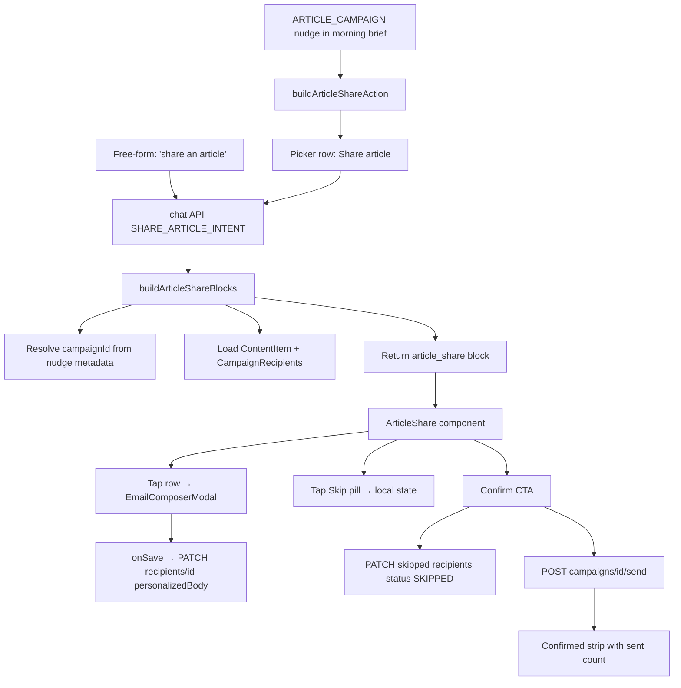

## Architecture



## What we reuse (no new data model)

- `ContentItem` (article catalog) and `Campaign` + `CampaignRecipient` from the existing `from-article` flow.
- `ARTICLE_CAMPAIGN` nudge already produced in [src/lib/services/nudge-engine.ts](src/lib/services/nudge-engine.ts) with metadata containing `contentItemId` and (when present) `campaignId`.
- [POST /api/campaigns/id/send](src/app/api/campaigns/[id]/send/route.ts) — already filters `toSend` to `status === "PENDING" | "FAILED"`, so flipping excluded rows to `SKIPPED` removes them from the send set with no route changes.
- [PATCH /api/campaigns/recipients/recipientId](src/app/api/campaigns/recipients/[recipientId]/route.ts) for both `personalizedBody` saves (modal) and `status: "SKIPPED"` (Confirm).
- [EmailComposerModal](src/components/chat/blocks/email-composer-modal.tsx) — its `onSave({ subject, body })` is generic; we just pass a recipient-scoped save handler.

## Files to add / modify

### 1. Block type — `src/lib/types/chat-blocks.ts` (modify)
Add `ArticleShareBlock` and append it to the `ChatBlock` union next to `CampaignApprovalBlock`:

```ts
export type ArticleShareBlock = {
  type: "article_share";
  data: {
    campaignId: string;        // backing draft campaign (status DRAFT)
    contentItemId: string;
    title: string;
    description?: string;
    imageUrl?: string;
    publishedAtLabel?: string; // e.g. "Apr 22"
    practice?: string;
    url?: string;
    subject: string;           // shared subject line for all recipients
    recipients: {
      recipientId: string;
      contactId: string;
      contactName: string;
      contactEmail: string;
      company?: string;
      personalizedSnippet?: string; // one-line preview, ≤80ch
      personalizedBody: string;     // full body, fed to the modal on tap
      defaultIncluded: true;
    }[];
    totalRecipients: number;
    visibleLimit: number;      // e.g. 4
  };
};
```

### 2. Block component — `src/components/chat/blocks/article-share.tsx` (new)
Mobile-first layout, mirroring the campaign-approval shell:

- **Hero header**: `imageUrl` rendered as a 4:3 cover with rounded top and `object-cover`; falls back to a `Newspaper` icon block. Below: title (font-semibold, line-clamp-2), description (text-sm muted, line-clamp-2), small meta strip with `practice` chip + `publishedAtLabel`.
- **Row list** (`<ul>`):
  - Whole row body is the tap target → opens `EmailComposerModal` seeded with `subject` + that recipient's `personalizedBody`. `onSave` PATCHes `/api/campaigns/recipients/{recipientId}` and updates local row state so the snippet refreshes.
  - Right-side chip: `Included` (blue, default) ↔ `Skipped` (muted with strikethrough on the name). `stopPropagation` so chip taps don't open the modal.
  - "+N more contacts" expander after `visibleLimit`.
- **CTA row** (must carry `data-cta-row` attribute for `StickyActionBar`): meta strip "{includedCount} to share · {skippedCount} skipped" + primary `Send to N contacts` button.
- **Confirmed state**: replaces the CTA row with a green strip "Sent to N contacts. M skipped." — same pattern as campaign approval.

State: `decisions: Map<recipientId, "INCLUDED" | "SKIPPED">`, `expanded`, `submitting`, `error`, `confirmed`, plus `editing: { recipientId } | null` for the modal. Short haptic on confirm via `navigator.vibrate(10)`.

`handleConfirm`: PATCH each `SKIPPED` recipient to `{ status: "SKIPPED" }` in parallel (best-effort), then `POST /api/campaigns/${campaignId}/send`. On `ok`, set `confirmed`.

### 3. Renderer dispatch — `src/components/chat/blocks/block-renderer.tsx` (modify)
Add `case "article_share":` next to `case "campaign_approval":` in the ungrouped fallback switch.

### 4. Chat API emission — `src/app/api/chat/route.ts` (modify)
- Add regex:
  ```ts
  const SHARE_ARTICLE_INTENT =
    /\b(share\s+(?:the\s+|an?\s+|this\s+)?article|articles?\s+to\s+share|share\s+(?:this\s+)?content)\b/i;
  ```
- Extend the existing nudge-override block with sibling boolean `isArticleShare`, set true when `nudgeLookup.ruleType === "ARTICLE_CAMPAIGN"`.
- Free-form fallback: `if (!isArticleShare && SHARE_ARTICLE_INTENT.test(message)) isArticleShare = true;`
- Add a top-level branch placed next to `if (isCampaignApproval)`:
  ```ts
  if (isArticleShare) {
    const blocks = await buildArticleShareBlocks({ partnerId, overrideNudge });
    if (blocks) return NextResponse.json({
      answer: "Here's the article queued to share — tap any contact to review their pre-drafted email, then Confirm.",
      sources: [],
      blocks,
    });
    return NextResponse.json({ answer: "No articles waiting to share right now.", sources: [] });
  }
  ```
- New helper `buildArticleShareBlocks({ partnerId, overrideNudge })`:
  1. If `overrideNudge?.ruleType === "ARTICLE_CAMPAIGN"`, read `metadata.campaignId` (preferred) or look up by `metadata.contentItemId + partnerId`.
  2. Otherwise pick the most recent open `ARTICLE_CAMPAIGN` nudge for `partnerId` from `nudgeRepo`.
  3. Load the `Campaign` (must be `status === "DRAFT"`, `source !== "CENTRAL"`) with `recipients` (contact + company), and the joined `ContentItem` from `CampaignContent`.
  4. Filter to recipients with `status === "PENDING"` and `personalizedBody != null`.
  5. Build snippets via the **existing** `buildRecipientSnippet` + `normalizeTemplateText` helpers already defined in this file (no duplication).
  6. Return `[{ type: "article_share", data: ... }]` or `null` when nothing to show.

### 5. Morning-brief picker — `src/app/mobile/page.tsx` (modify)
Mirror `buildCampaignApprovalAction`:

```ts
function buildArticleShareAction(data: BriefingData | null): RichActionItem | null {
  const nudge = data?.structured?.nudges?.find((n) => n.ruleType === "ARTICLE_CAMPAIGN");
  if (!nudge) return null;
  // Parse article title + recipient count from reason / metadata, same shape as campaign approval.
  return {
    actionLine: "Share an article",
    subjectLine: `${articleTitle} · ${count} contact${count === 1 ? "" : "s"}`,
    leadingIcon: Newspaper,        // already in lucide-react
    query: "Share an article",     // matches SHARE_ARTICLE_INTENT
  };
}
```

Insert in `getInitialPickerActions` directly **after** `campaignRow` and **before** the trim+catch-all append, so picker order is: meeting prep / draft emails / today / **campaign approval** / **article share** / Who needs attention.

`extractContactDraftTargets` already excludes `ARTICLE_CAMPAIGN`, so this won't generate duplicate "draft email" rows.

### 6. Recipient PATCH allowlist — verify only
[src/app/api/campaigns/recipients/[recipientId]/route.ts](src/app/api/campaigns/recipients/[recipientId]/route.ts) already accepts `personalizedBody`. Confirm it accepts `status: "SKIPPED"` writes; if the allowlist is strict, add the single value. ≤1 line of change at most.

### 7. Tests
Reuse the campaign-approval test patterns:
- `buildArticleShareBlocks` returns null when no `ARTICLE_CAMPAIGN` nudge, or when the linked campaign is not DRAFT, or has no eligible recipients.
- Snippet token substitution renders cleanly (no `'s` orphans) for article personalizations.
- Free-form regex coverage: `"share this article"`, `"articles to share"`, `"share content with the team"` all set `isArticleShare`.

## Out of scope / follow-ups (call out, do not build)

- **Per-contact subject line edit** — modal saves subject too, but the campaign currently uses a single shared subject. v1 persists body only; subject changes from the modal are dropped server-side.
- **Deleting recipients** instead of skipping — `status: SKIPPED` keeps history; we do not delete rows.
- **Dev-only retrigger for article shares** — easy follow-up: mirror the campaign-approval reset block in `nudge-engine.ts` to flip `SKIPPED` recipients back to `PENDING` and `SENT|IN_PROGRESS` `ARTICLE_CAMPAIGN`-backed campaigns to `DRAFT`. Not blocking.
- **Editing inside the chat instead of full-screen modal** — explicitly chosen against in clarification.
