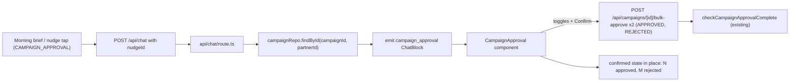

# Mobile Campaign Approval Block

## Visual reference

Card adapts the attached Instacart screenshot: header with brand chip + campaign name + one-line description; product-row analog = contact row with avatar, name/company, one-line personalized preview, per-row decision toggle; "+N more contacts" expander; deadline footer + total count; primary Confirm at bottom. **No campaign-level edit affordance** — for CENTRAL campaigns the partner's only edit surface is per-contact (covered as a follow-up below).

## Block layout (mobile-only, in-chat)

```
+----------------------------------------+
| [icon] Campaign name                   |
|        One-line description            |
+----------------------------------------+
| [MC]  Morgan Chen           [Approved] |
|       Acme Capital      • snippet...   |
| [SR]  Sam Rivera            [Approved] |
|       Bridge Partners   • snippet...   |
| [+5]  +5 more contacts                 |
+----------------------------------------+
| Deadline 4:30 pm        6 ready  · 1 X |
+----------------------------------------+
|             [ Confirm ]                |
+----------------------------------------+
```

Toggling a row flips the chip between `Approved` (neutral pill, green check) and `Rejected` (neutral pill, red x), matching the recent palette pass — blue is reserved for the primary Confirm only.

## Data flow



No new endpoints. The existing `POST /api/campaigns/[id]/bulk-approve` (`src/app/api/campaigns/[id]/bulk-approve/route.ts`) already accepts `{ recipientIds, action }`; we call it once with `APPROVED` ids and once with `REJECTED` ids in parallel.

## Files to create

- [src/components/chat/blocks/campaign-approval.tsx](../../src/components/chat/blocks/campaign-approval.tsx) — the new block component (header, recipients list, expander, footer, Confirm button, submit + confirmed state).

## Files to edit

- [src/lib/types/chat-blocks.ts](../../src/lib/types/chat-blocks.ts) — add `CampaignApprovalBlock`, extend `ChatBlock` union (the existing list of 13 block types becomes 14):

  ```ts
  export interface CampaignApprovalBlock {
    type: "campaign_approval";
    data: {
      campaignId: string;
      name: string;
      description: string;
      deadline?: string;
      recipients: Array<{
        recipientId: string;
        contactName: string;
        company?: string;
        contactId?: string;
        personalizedSnippet?: string;
        defaultDecision: "APPROVED" | "REJECTED";
      }>;
      totalRecipients: number;
      visibleLimit: number;
    };
  }
  ```

- [src/components/chat/blocks/block-renderer.tsx](../../src/components/chat/blocks/block-renderer.tsx) — add `case "campaign_approval"` to the dispatch `switch (block.type)` at lines ~318–358.

- [src/app/api/chat/route.ts](../../src/app/api/chat/route.ts) — within the existing CAMPAIGN_APPROVAL nudge branch (currently filtered out of contact-only quick actions), add a path that:
  - Parses `metadata.campaignId` (already stored by `nudge-engine.ts` lines 588–602).
  - Calls `campaignRepo.findById(campaignId, partnerId)` to load campaign + recipients (per `src/lib/repositories/prisma/campaign-repository.ts`).
  - Filters recipients to those assigned to this partner with `approvalStatus === "PENDING"`.
  - Builds a one-line `description` (first sentence of `Campaign.bodyTemplate` or `Campaign.subject`) and per-row `personalizedSnippet` (first ~80 chars of `personalizedBody` or `bodyTemplate`).
  - Returns a `campaign_approval` ChatBlock plus a brief `answer` ("Here's the campaign waiting on your approval.").

- (Small, same file) Add a regex intent for "approve campaign" / "review campaign" mirroring the existing `regexIntent` switch at lines 35–80 to surface the partner's most-urgent pending CENTRAL campaign even without a `nudgeId`.

## Submit flow inside the component

```ts
async function onConfirm() {
  setSubmitting(true);
  const approved = decisions.filter(d => d.action === "APPROVED").map(d => d.recipientId);
  const rejected = decisions.filter(d => d.action === "REJECTED").map(d => d.recipientId);
  const calls: Promise<Response>[] = [];
  if (approved.length) calls.push(fetch(`/api/campaigns/${campaignId}/bulk-approve`,
    { method: "POST", headers: { "Content-Type": "application/json" },
      body: JSON.stringify({ recipientIds: approved, action: "APPROVED" }) }));
  if (rejected.length) calls.push(fetch(`/api/campaigns/${campaignId}/bulk-approve`,
    { method: "POST", headers: { "Content-Type": "application/json" },
      body: JSON.stringify({ recipientIds: rejected, action: "REJECTED" }) }));
  const responses = await Promise.all(calls);
  if (responses.every(r => r.ok)) {
    setConfirmed({ approved: approved.length, rejected: rejected.length });
  } else {
    setError("Couldn't submit some decisions. Try again.");
  }
}
```

After confirmation the block stays in place and replaces the action area with a "{N} approved · {M} rejected" summary. The existing server-side `checkCampaignApprovalComplete` flips the campaign to `IN_PROGRESS`/`CANCELLED` once all recipients are resolved.

## Out of scope (follow-ups)

- Per-contact email body editing inside the campaign block. This is the eventual edit story (CENTRAL campaigns are not editable at the campaign level — partners only edit at the contact level), but for v1 the row chip is approve/reject only. A natural next step is: tap a row → expand inline (or open the existing `EmailComposerModal`) to edit `personalizedBody` before the row is approved, persisting via `PATCH /api/campaigns/recipients/[recipientId]`.
- Swipe gestures — confirm-button-only for v1.
- Promoting submission to the `pendingAction` + `confirmation_card` round-trip pattern (matches email send/dismiss/snooze symmetry; can be added later if desired).
