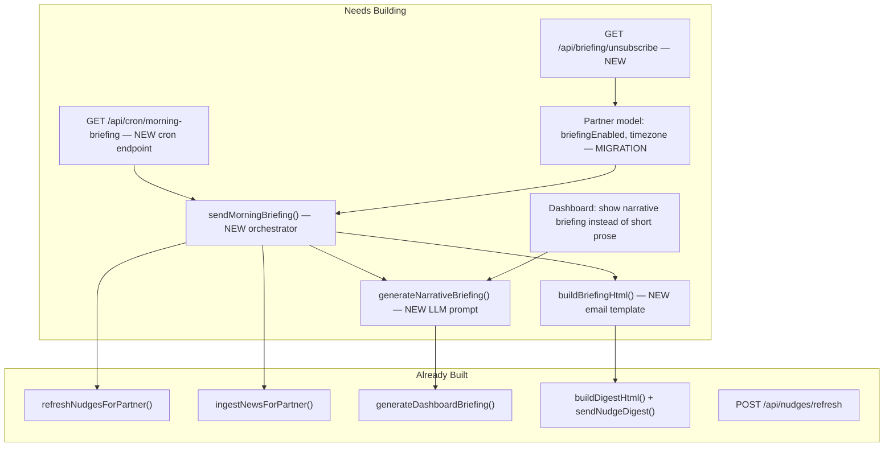

# Narrative AI Morning Briefing — Design & Build Plan

**Date:** 2026-03-26
**Status:** Approved
**Feature:** Phase 1 Wedge — Concierge Intelligence Platform

## Overview

Build the Narrative AI Morning Briefing feature — a daily email that weaves nudges, meetings, news, and relationship context into a 2-minute narrative read delivered to each Partner's inbox, with an in-app preview on the dashboard.

## What Already Exists (leverage, don't rebuild)

- **`generateDashboardBriefing()`** in `src/lib/services/llm-service.ts` — generates a 3-5 sentence prose briefing from nudges/meetings/news. This is the in-app version shown on the dashboard. Has a template fallback.
- **`buildDigestHtml()` + `sendNudgeDigest()`** in `src/lib/services/email-service.ts` — sends an HTML email with nudge cards. This is a **nudge list** email, NOT a narrative briefing. Uses MDS palette (deep blue `#051C2C`, Electric Blue `#2251FF`, Georgia headlines).
- **`refreshNudgesForPartner()`** in `src/lib/services/nudge-engine.ts` — full nudge generation with 9 signal types, consolidation, and cross-partner awareness.
- **`ingestNewsForPartner()`** in `src/lib/services/news-ingestion-service.ts` — Tavily news fetch, batched by company, anchored on executive names.
- **`POST /api/nudges/refresh`** in `src/app/api/nudges/refresh/route.ts` — already chains: news ingestion -> nudge refresh -> email digest + SMS. Requires auth.
- **`GET /api/dashboard/briefing`** in `src/app/api/dashboard/briefing/route.ts` — returns the in-app prose briefing for the logged-in Partner.
- **`scripts/send-nudge-email.ts`** — standalone CLI script that generates nudges and sends the digest email.
- **Prisma schema** — `Partner` model has `email` but no `briefingEnabled` or `timezone` fields.
- **No cron/scheduler infrastructure** — no `api/cron/` routes, no Vercel cron config, no external scheduler.

## Gap Analysis — What Needs to Be Built



## Workstreams (7 tasks)

### 1. Schema migration — add briefing fields to Partner

Add two fields to the `Partner` model in `prisma/schema.prisma`:

```prisma
briefingEnabled Boolean @default(true) @map("briefing_enabled")
timezone        String  @default("America/New_York") @map("timezone")
```

Run migration. Update seed if needed.

### 2. New LLM function — `generateNarrativeBriefing()`

In `src/lib/services/llm-service.ts`, add a new function that produces a **narrative** (not bullet list) briefing. Key differences from the existing `generateDashboardBriefing()`:

- **Input:** same `DashboardBriefingContext` + `relationshipHealthSummary` (optional, for future) + `cadenceUpdates` (optional, for future)
- **Output:** structured object with `{ narrative: string, topActions: { contactName, company, actionLabel, deeplink }[] }` so the email can render both the prose AND action CTAs
- **Prompt:** "Write a 2-minute morning briefing in the voice of a trusted chief of staff. Weave together the most important nudges, upcoming meetings, and client news into a flowing narrative. Lead with the single most important thing. Reference people by first name after first mention. End with the top 3 actions."
- **Template fallback** that generates reasonable prose when OpenAI is unavailable (expand existing `generateBriefingTemplate()`)
- Reuse `callLLM()` — no new OpenAI infra needed

### 3. New email template — `buildBriefingHtml()`

In `src/lib/services/email-service.ts`, add a new function alongside `buildDigestHtml()`. Structure:

- **Header:** "ACTIVATE" mark + "Good morning, Taylor" + date (reuse MDS palette)
- **Narrative block:** Full-width prose section — the LLM narrative rendered as HTML paragraphs. This is the hero content, not a card grid.
- **Top 3 Actions:** Compact action rows below the narrative — contact name, reason, one CTA button (deeplink to `/nudges?highlight={nudgeId}` or `/contacts/{id}`)
- **Meeting preview:** If meetings today, one compact row per meeting with title + time + attendee count
- **Footer:** "Open ClientIQ" button + "Manage preferences" link + unsubscribe link
- **Email-safe HTML:** 600px table layout, inline styles, no CSS (same pattern as existing `buildDigestHtml`)

This is **not** the same as the existing nudge digest — it replaces it for briefing subscribers. The nudge digest remains available for Partners who prefer list format (future setting).

### Email Design

```
┌──────────────────────────────────────────────────┐
│  ACTIVATE                          (#051C2C bg)  │
│  Good Morning, Taylor                            │
│  Wednesday, March 26, 2026                       │
├──────────────────────────────────────────────────┤
│                                                  │
│  Your most important move today is reconnecting  │
│  with Sarah Chen at Apex Corp — it's been 94     │
│  days since your last conversation, and there's  │
│  fresh news: Apex just announced a major Q2      │
│  restructuring that could open doors for your    │
│  advisory practice...                            │
│                                                  │
│  You also have a meeting tomorrow with James     │
│  Liu at TechGlobal for Q3 Planning...            │
│                                                  │
│  On the radar: NovaTech's new partnership with   │
│  AWS could be relevant to your work with their   │
│  CTO, Priya Sharma...                            │
│                                                  │
├──────────────────────────────────────────────────┤
│  YOUR TOP 3 ACTIONS                              │
│                                                  │
│  1. Sarah Chen · Apex Corp                       │
│     94 days since last contact                   │
│     [Draft Check-in Email →]                     │
│                                                  │
│  2. James Liu · TechGlobal                       │
│     Meeting tomorrow at 10:00 AM                 │
│     [Review Meeting Brief →]                     │
│                                                  │
│  3. Priya Sharma · NovaTech                      │
│     New company news                             │
│     [View Signal →]                              │
│                                                  │
├──────────────────────────────────────────────────┤
│              [Open ClientIQ]                     │
├──────────────────────────────────────────────────┤
│  You're receiving this because briefings are     │
│  enabled. Unsubscribe · Manage preferences       │
└──────────────────────────────────────────────────┘
```

**Design decisions:**

| Decision | Choice | Why |
|----------|--------|-----|
| Hero content | Flowing prose, not cards | "2-minute read over coffee" — a letter, not a dashboard |
| Tone | "Your most important move today is..." | Chief-of-staff voice. First-person address, first names after first mention |
| Structure | Lead with #1 action, then context, then "on the radar" | Most important first — Partners stop reading after 30 seconds |
| Action section | 3 compact rows, not full nudge cards | Narrative already explained the "why" — actions just need name + CTA |
| CTA deeplinks | `/contacts/{id}?nudge={nudgeId}` or `/meetings/{id}` | Opens ClientIQ with context pre-loaded. NOT server-side send (firm policy) |
| Palette | Same MDS as existing digest | Deep blue `#051C2C`, Electric Blue `#2251FF`, Georgia serif for greeting |
| No meeting brief inline | Just time + link | Full brief is too long — keep email scannable |
| Unsubscribe | Visible in footer, signed token link | Sets `briefingEnabled = false` on Partner model |
| Width | 600px table layout, inline styles | Email-safe, same pattern as existing digest |

### 4. New orchestrator — `sendMorningBriefing()`

In a new file `src/lib/services/briefing-service.ts`:

```typescript
export async function sendMorningBriefing(partnerId: string): Promise<{
  sent: boolean;
  error?: string;
}>
```

Steps:

1. Load Partner (check `briefingEnabled`)
2. Call `ingestNewsForPartner(partnerId)` — refresh news
3. Call `refreshNudgesForPartner(partnerId)` — refresh nudges
4. Load top nudges, upcoming meetings, recent client news (same queries as dashboard/briefing route)
5. Call `generateNarrativeBriefing()` — get the narrative + top actions
6. Call `buildBriefingHtml()` — render email
7. Send via Resend
8. Log send to console (audit logging deferred to eng review)

### 5. Cron API route — `GET /api/cron/morning-briefing`

New file `src/app/api/cron/morning-briefing/route.ts`:

- **Auth:** Verify a `CRON_SECRET` header/query param (not session-based — cron jobs aren't logged-in users)
- **Logic:** Load all Partners where `briefingEnabled = true`, iterate, call `sendMorningBriefing()` for each
- **Timezone handling for v1:** Send for all Partners in a single run. The cron is configured to run at 7am EST (the default timezone). Per-timezone scheduling is Phase 2 complexity.
- **Response:** JSON summary of `{ sent: N, failed: N, errors: [...] }`

Add `vercel.json` or equivalent cron config:

```json
{ "crons": [{ "path": "/api/cron/morning-briefing?secret=...", "schedule": "0 12 * * 1-5" }] }
```

(12:00 UTC = 7am EST, weekdays only)

If not using Vercel: document how to trigger via external cron (curl, GitHub Actions, etc.)

### 6. Unsubscribe endpoint

New file `src/app/api/briefing/unsubscribe/route.ts`:

- `GET /api/briefing/unsubscribe?token={jwt}` — decode partner ID from a signed token, set `briefingEnabled = false`, redirect to a confirmation page
- Token generation: simple JWT with partner ID + expiry, signed with `CRON_SECRET` or a new `BRIEFING_SECRET`

### 7. Dashboard integration — show narrative in-app

Update `src/app/api/dashboard/briefing/route.ts` and the dashboard page to use the richer narrative format. The dashboard already shows `generateDashboardBriefing()` output — swap to `generateNarrativeBriefing()` so the in-app and email briefings use the same content.

**Placement:** Same hero card on dashboard, richer content. The narrative replaces the current short prose in the Conversational Panel card. The `topActions` render as compact link-style buttons between the narrative and the chat input divider.

```
┌──────────────────────────────────┐
│ ✦ ClientIQ                       │
│ "Taylor, this morning your top   │
│  priority is Sarah Chen at       │
│  Apex — she hasn't heard from    │
│  you in 94 days and there's      │
│  fresh news about Apex's Q2..."  │
│                                  │
│  [→ Draft email to Sarah Chen]   │
│  [→ Prep for James Liu meeting]  │
│  [→ Review Apex news]            │
│──────────────────────────────────│
│ [✦ Ask AI a question...]   [Ask] │
│ [Summarize my week] [Who needs..]│
└──────────────────────────────────┘
```

## File Changes Summary

| File | Change |
|------|--------|
| `prisma/schema.prisma` | Add `briefingEnabled`, `timezone` to Partner |
| `src/lib/services/llm-service.ts` | Add `generateNarrativeBriefing()` + expanded template fallback |
| `src/lib/services/email-service.ts` | Add `buildBriefingHtml()` |
| `src/lib/services/briefing-service.ts` | **NEW** — orchestrator |
| `src/app/api/cron/morning-briefing/route.ts` | **NEW** — cron endpoint |
| `src/app/api/briefing/unsubscribe/route.ts` | **NEW** — unsubscribe |
| `src/app/api/dashboard/briefing/route.ts` | Swap to narrative briefing |
| `src/app/dashboard/page.tsx` | Render topActions below briefing |
| `vercel.json` or equivalent | Cron schedule config |
| `.env.local` / `.env.example` | Add `CRON_SECRET` |

## Env Variables Needed

- `CRON_SECRET` — authenticates the cron route (new)
- `OPENAI_API_KEY` — already exists
- `RESEND_API_KEY` — already exists
- `NUDGE_EMAIL_TO` — already exists (dev override)

## What Is NOT In Scope

- Per-timezone cron scheduling (v1 sends at one fixed time; per-timezone is Phase 2)
- Cadence engine integration in the briefing (deferred — cadence engine itself isn't built yet)
- Relationship health scoring in the briefing (deferred — scoring isn't built yet)
- Email open/click tracking for analytics (deferred to Nudge Analytics workstream)
- Briefing preference UI in `/dashboard/settings` (can be added later; unsubscribe link covers opt-out)
- SMS briefing variant (existing SMS digest covers this channel for now)
